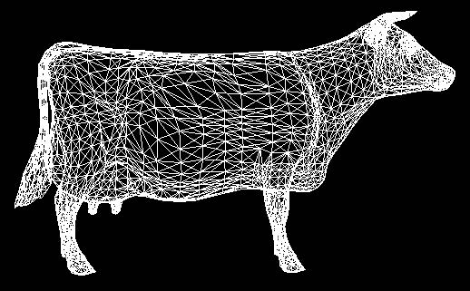

SMFReader
=========

An app to read and show smp file.

This app implements parallel and perspective projection to display a 3D modal with any scaling or rotating.

On the other hand, this app also implements the *Hidden-line Removal* and *Hidden-surface Removal* algorithms based on *Z-Buffer* and *OpenGL*.

### Notice ###

This app needs open of *[GLUT](http://www.opengl.org/resources/libraries/glut/)* in some cases.

### TODO ###

1. Memory Leak still exists
2. Photorealistic rendering is not good enough

### USE CASE ###

#### Hidden-line Removal ####

1. Press "浏览" (Browse)
2. Choose an .smf file
3. Press "显示" (Display)
4. Press "Z面消隐正平行视图" (Z hidden-face parallel projection)

And it display:

#### Parallel Projection ####

1. Press "浏览" (Browse)
2. Choose an .smf file
3. Press "显示" (Display)
4. Press "X/Y/Z面消隐正平行视图" (X/Y/Z hidden-face parallel projection)

And it display like this:

#### Hidden-line Removal with OpenGL ####

1. Press "浏览" (Browse)
2. Choose an .smf file
3. Select "线消隐" (Hidden-Line Removal)
4. Press "显示" (Display)

And it display:

#### Parallel and Perspective Projection with OpenGL ####

1. Press "浏览" (Browse)
2. Choose an .smf file
3. Select "平行投影/透视投影" (Parallel / Perspective projection)
4. Press "显示" (Display)

And it display like this:

#### Scaling, Rotating and Dragging ####

1. Press "浏览" (Browse)
2. Choose an .smf file
3. Select "平行投影/透视投影" (Parallel / Perspective projection)
4. Press "显示" (Display)
5. Drag the bar on the right

And it display like this:

